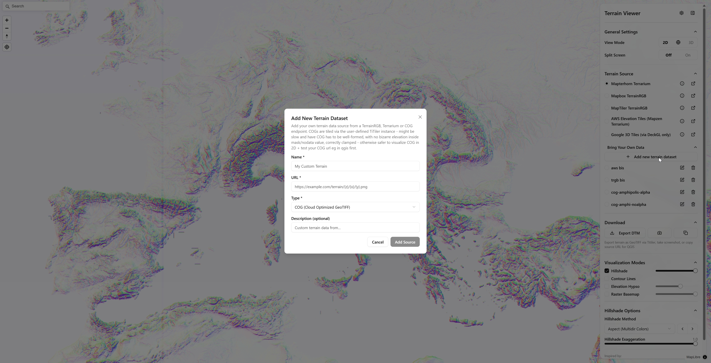

# Terrain Visualization Modes

A comprehensive terrain visualization and downloading tool, built on top of MapLibre GL via react-map-gl. Explore different terrain visualization modes introduced in 2025 including hillshade, hypsometric tinting, contour lines, and more.




[demo screencast recording](https://www.dropbox.com/scl/fi/9m0gt1lonbo3sm1bqk3ha/elevation-terrain-viewer.mp4?rlkey=nqbo8w16q44f96sq126orr2k4&st=es40sopg&dl=0)

## Features

- **Multiple Terrain Sources**: Mapterhorn, Mapbox, MapTiler, AWS Elevation Tiles (based on mapzen)
- **Visualization Modes**:
  - Hillshade with multiple algorithms (Standard, Combined, Igor, Basic, Multidirectional and colored, similar to aspect), see [Hillshade Methods PR #5768](https://github.com/maplibre/maplibre-gl-js/pull/5768)
  - Hypsometric Tint (color encoded elevation) with customizable color ramps, see [Hypsometric Tint PR #5913](https://github.com/maplibre/maplibre-gl-js/pull/5913) and additional hypsos in [CPT City Color Ramps](http://seaviewsensing.com/pub/cpt-city/)
  - Contour Lines with configurable intervals via [Contour Lines Discussion](https://github.com/maplibre/maplibre-style-spec/issues/583) which resulted in the [onthegomap/maplibre-contour](https://github.com/onthegomap/maplibre-contour) plugin
  - Raster basemap on which the terrain viz modes are overlaid
- **Bring Your Own Data**: Add terrain sources XYZ terrainrgb/terrarium or COG (wip, via titiler) 
- **View Modes**: 2D, 3D, and Globe projections
- **Split Screen**: Compare two terrain sources side-by-side
- **Download**: Export terrain as GeoTIFF via Titiler or screenshot canvas, and copy source URL for QGIS integration (terrarium/terrainrgb encoding)
- **User configuration**: Settings persisted to localStorage via jotai like titiler instance and maximum resolution, theme style switcher, API keys, additional terrain sources, and info

## Getting Started

### Installation

```bash
# Clone the repository
git clone https://github.com/iconem/elevation-terrain-visualizer.git
cd elevation-terrain-visualizer

pnpm install
pnpm run dev
pnpm run build # bundles to dist dir
```

Open [http://localhost:5173](http://localhost:5173) to view the app.

## Technologies

- MapLibre GL v5
- React Map GL
- nuqs for ur search query state persistence + jotai for atomWithStorage
- shadcn/ui + Tailwind CSS v4 for components and UI
- maplibre-contour

## Inspiration

This project was inspired by:
- [Tangram Height Mapper](https://tangrams.github.io/heightmapper/)
- [Impasto CAS Viewer](https://impasto.dev/)

## License

MIT License - feel free to use this project for any purpose.

