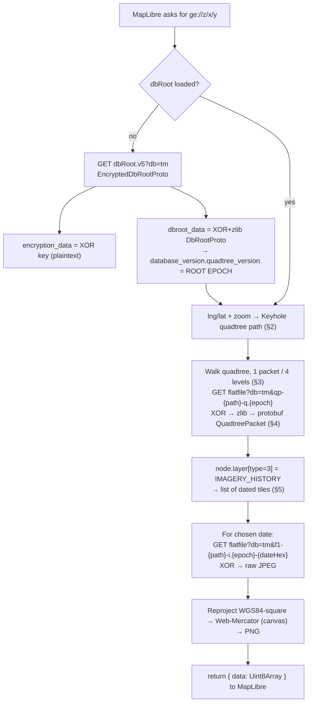
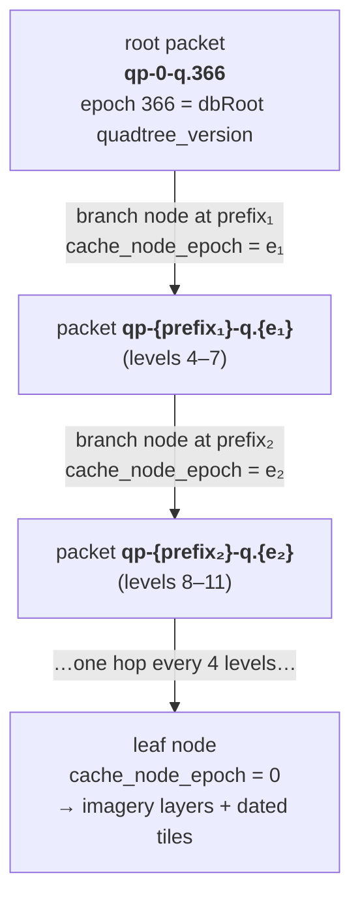
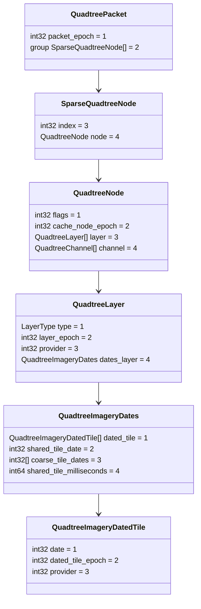

"Google Earth Historical" is one of four providers behind [Historical Imagery mode](/features/basemaps-and-historical) — the one that reaches occasional very old outlier captures for well-covered areas, via a reverse-engineered protocol scaffolded from [Iconem's own GE_TimeMachine](https://github.com/Iconem/GE_TimeMachine). This page has two parts: the protocol itself (how Google's undocumented "Time Machine" data format actually works — universal, not app-specific) and how this app wires it in (which is app-specific and diverges from GE_TimeMachine's own standalone-demo instructions).

There is no official API for this data today, but that may change: [Google's issue tracker](https://issuetracker.google.com/issues/35826354) shows they are tracking interest in official Historical Imagery API access, and activity there suggests work is being done toward offering it. In the meantime, this implementation mocks up a Google Earth Enterprise client to make the imagery viewable.

## Built on

Reading Time Machine end-to-end means walking an undocumented, encrypted, protobuf quadtree protocol. GE_TimeMachine builds on several open-source projects, reusing their logic and reverse-engineering directly wherever the work is substantial:

- **[GEHistoricalImagery](https://github.com/Mbucari/GEHistoricalImagery)** (Mbucari) — the primary reference for the `tm` protocol: the `flatfile`/`dbRoot` endpoints, the quadtree walk (one packet per 4 levels following `cache_node_epoch`), the sub-index math, the bit-packed date format, and the fact that Time Machine is built from the `tm` database alone. The quadtree-path math is a direct port of its `KeyholeTile`.
- **[CesiumJS](https://github.com/CesiumGS/cesium)** — the XOR keystream is its `decodeGoogleEarthEnterpriseData` algorithm; its `GoogleEarthEnterpriseMetadata` confirmed the GEE quadkey digit layout.
- **[protobuf.js](https://github.com/protobufjs/protobuf.js)** — decodes every packet/dbRoot message, with one hand-written shim for the proto2 *group* it can't encode/decode (see §4 below).
- **[ESRI wayback-core](https://github.com/Esri/wayback-core)** — a contrasting release-chained model that helped clarify how GE's self-contained per-tile dates differ; see [ESRI Wayback](/dev/esri-wayback) for how that model works and is used by this app.
- **pako** for zlib; **MapLibre GL JS** for the map and the custom-protocol API.

## 1. Big picture



All capture dates for a tile live in that tile's single decoded quadtree packet — no release-to-release chaining (the opposite of ESRI Wayback).

## 2. The Keyhole quadtree path (not Web-Mercator, not Bing)

Earth is recursively split into 4 quadrants; a tile is a **path string** of digits `0..3` (one per zoom level) that always starts with `0` (root).

- The grid is **plate-carrée** (equirectangular, EPSG:4326-style square tiling): `row = col = floor((deg + 180)/360 · 2^level)`, rows increasing **north**. This is **not** the EPSG:3857 Web-Mercator quadrant scheme slippy `{z}/{x}/{y}` tiles use — exactly why the protocol reprojects each fetched tile.
- The digit is `(row_bit << 1) | (row_bit XOR col_bit)`. This is **not** the Bing/standard quadkey (`x_bit | y_bit<<1`) — verified over 4000 random tiles they differ ~95% of the time. Computed directly (matching GEHistoricalImagery's `KeyholeTile` exactly); CesiumJS is used only for the XOR keystream, not the tiling.

## 3. Packets, epochs, branch nodes, and the 4-level walk

A packet (`qp-{path}-q.{epoch}`) bundles up to `1 + 4 + 16 + 64 + 256 = 341` nodes — a 4-level-deep sub-tree. Most nodes are leaves carrying imagery layers; some are **branch nodes**, sitting on the bottom (4-level) boundary of one packet and pointing to the *next* packet via **`cache_node_epoch`**. A node whose `cache_node_epoch == 0` is a true leaf.

**"Epoch" is a cache/version number, not a date** — Google's way of versioning a packet so URLs are cache-bustable:

- `quadtree_version` (from dbRoot) = the root packet's epoch.
- `cache_node_epoch` (on a branch node) = the child packet's epoch.
- `dated_tile_epoch` (on each dated tile) = the epoch that goes in the image-tile URL.



## 4. Protobuf + the proto2 *group* (a protobuf.js limitation)

`QuadtreePacket.sparse_quadtree_node` (field 2) is a proto2 **group** (framed by start-group/end-group tags, no length prefix). protobuf.js's `.proto` parser accepts the `group` keyword but its encoder/decoder never implemented group wire types — it silently treats the field as length-delimited (wire type 2), and desyncs with *"invalid wire type 7"* on Google's real group-encoded bytes. (Google's own C# protobuf, and Cesium's hand-rolled parser, both handle groups natively.) GE_TimeMachine hand-walks the group framing itself and decodes each inner `QuadtreeNode` (a normal message) with protobuf.js. Groups appear only here; everything below `QuadtreeNode` is ordinary length-delimited.

## 5. The schemas



`LayerType`: `0=IMAGERY, 1=TERRAIN, 2=VECTOR, 3=IMAGERY_HISTORY` — this app reads only `IMAGERY_HISTORY`.

## 6. "Epoch" vs "date"

Date is `QuadtreeImageryDatedTile.date`, a bit-packed integer: `date = (year << 9) | (month << 5) | day`, decoded as `year = date >> 9`, `month = (date >> 5) & 0x0F`, `day = date & 0x1F`. Values `≤ 545` are sentinels and ignored. The tile URL uses this packed integer in lower-case hex: `…-i.{epoch}-{date.toString(16)}`.

## 7. Decrypt & decompress

Everything (dbRoot body, packets, tiles) is XOR-obfuscated with one keystream whose key ships in clear in `encryption_data`. After XOR, packets are zlib with an 8-byte header (`uint32 magic 0x7468dead`, `uint32 uncompressed_size`, then the zlib stream); image tiles are raw JPEG with no protobuf wrapper. XOR is symmetric.

## 8. Endpoints

Host `https://khmdb.google.com`, `db=tm`:

| purpose | URL |
|---|---|
| dbRoot (key + root epoch) | `/dbRoot.v5?db=tm&hl=en&gl=us&output=proto` |
| quadtree packet | `/flatfile?db=tm&qp-{path}-q.{epoch}` |
| dated image tile | `/flatfile?db=tm&f1-{path}-i.{epoch}-{dateHex}` |

Time Machine is built from `tm` alone — no dependency on the default Google Earth database.

## How this app wires it in

The vendored protocol source lives at `lib/ge-timemachine/ge-historical.js` + `ge-decrypt.js` — a plain vendored copy (not a submodule), added in a single commit alongside the rest of the app. `lib/ge-historical.ts` is a thin app-side wrapper:

```ts
// lib/ge-historical.ts
let geInstance: ReturnType<typeof registerGEHistorical> | null = null

function getGe() {
  if (!geInstance) geInstance = registerGEHistorical(maplibregl, {})
  return geInstance
}
```

registered lazily (on first use, not at app mount) with an **empty options object** — no proxy, no debug flag, `maxLevel` left at the library default.

**No CORS proxy.** GE_TimeMachine's own docs (and the demo instructions above) assume `khmdb.google.com` needs a CORS proxy for a browser deploy. This app doesn't use one — a direct `fetch()` against Google's endpoints was confirmed to succeed (including a full dbRoot+tile round trip) in both dev and production, because they already send a permissive `Access-Control-Allow-Origin`. The library's `proxyUrl`/`setProxy` mechanism is still present in the vendored code but never invoked here.

**Layer wiring and date selection.** `components/LayersAndSources/MapSources.tsx` treats `ge-historical` as one branch of the basemap-source memo:

```tsx
if (basemapSource === "ge-historical") {
  if (!date) return null
  return geHistoricalTileSource(date)
}
```

There's no imperative `setDate()` call — `geHistoricalTileSource(dateMs)` calls `ge.makeRasterSource({ year, month, day })` fresh on every render, and MapLibre's `<Source>` diffs the resulting `tiles` template and re-fetches. Date itself is per-view `nuqs` URL state (consistent with the app's ["URL as app state"](/dev#the-url-as-app-state) architecture) — dragging a handle on the [historical timeline](/features/basemaps-and-historical) updates that URL param, which flows down into the source memo. Available scrubber tick marks come from `useGeHistoricalDates(lat, lng, zoom)`, which calls `ge.getDatesForPath()` for the real per-tile capture dates, debounced 400ms.

**Attribution** is split in two, since MapLibre/react-map-gl's `<Source>` reconciler can't live-update `attribution` post-mount: the source's static `attribution` prop is a placeholder, while the real per-tile provider (e.g. "Google Earth - CNES / Airbus") is resolved separately via `useGeHistoricalDynamicAttribution` and shown in the sidebar's Source Info panel.

**Registries.** `ge-historical` is registered into `HISTORICAL_BASEMAP_IDS` (`lib/historical-sources.ts`) and `EXPORT_SOURCE_IDS` (`lib/historical-export-sources.ts`), so `listExportTicks("ge-historical", ...)` can call the same `listGeHistoricalTicksInRange`/`geHistoricalTileSource` pair the live map uses to feed batch export (`lib/export-multi.ts`) without a mounted component.

## Limitations

- Coverage is sparse and mostly appears at higher zooms — "no dated history" for a tile is a coverage signal, not an error.
- Vertical reprojection (WGS84-square → Web-Mercator) scales linearly within a tile — sub-pixel error at high zoom.
- Google's endpoints are undocumented and may change without notice; request shapes mirror GEHistoricalImagery's.
